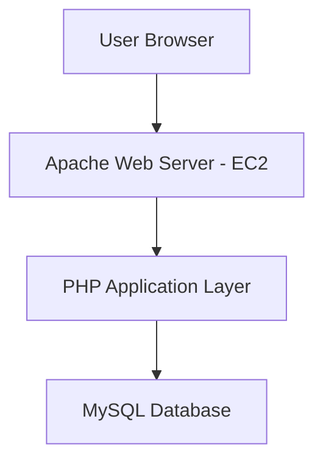

# 🚀 LAMP Stack Application Hosting on AWS EC2


---

## 📌 Project Overview

This project demonstrates the deployment of a **LAMP Stack (Linux, Apache, MySQL, PHP)** on an AWS EC2 Ubuntu instance. It showcases cloud server provisioning, web hosting, database configuration, and backend integration.

---

## 🏗️ Architecture Diagram



---

## ⚙️ Tech Stack

| Component | Technology |
|-----------|-----------|
| ☁️ Cloud Platform | AWS EC2 (Ubuntu 22.04 LTS) |
| 🌐 Web Server | Apache2 |
| 🗄️ Database | MySQL |
| 🐘 Backend | PHP |
| 🐧 OS | Linux (Ubuntu) |
| 🔐 Access | SSH (Git Bash / PuTTY) |

---

## 🎯 Key Features

- ☁️ AWS EC2 instance provisioning
- 🔒 Secure Linux server configuration
- 🌐 Apache web server deployment
- 🗄️ MySQL database setup & management
- 🐘 PHP backend integration
- 🚀 Dynamic web application deployment
- 🌍 Full-stack cloud hosting

---

## 🚀 Step-by-Step Setup

### 1️⃣ Launch EC2 Instance

- **AMI:** Ubuntu 22.04 LTS
- **Security Groups:**
  - SSH → Port **22**
  - HTTP → Port **80**

---

### 2️⃣ Connect to EC2

```bash
ssh -i lamp-key.pem ubuntu@<EC2-PUBLIC-IP>
```

---

### 3️⃣ System Update

```bash
sudo apt update && sudo apt upgrade -y
```

---

### 4️⃣ Install Apache Web Server

```bash
sudo apt install apache2 -y
sudo systemctl start apache2
sudo systemctl enable apache2
```

**Check status:**

```bash
systemctl status apache2
```

---

### 5️⃣ Install MySQL Server

```bash
sudo apt install mysql-server -y
sudo systemctl start mysql
```

**Secure MySQL installation:**

```bash
sudo mysql_secure_installation
```

---

### 6️⃣ Install PHP

```bash
sudo apt install php libapache2-mod-php php-mysql -y
php -v
```

---

### 7️⃣ Create PHP Test Page

```bash
sudo nano /var/www/html/info.php
```

```php
<?php
phpinfo();
?>
```

---

### 8️⃣ Database Setup

```bash
sudo mysql -u root -p
```

```sql
CREATE DATABASE studentdb;

USE studentdb;

CREATE TABLE students (
    id INT AUTO_INCREMENT PRIMARY KEY,
    name VARCHAR(100),
    course VARCHAR(100)
);
```

---

### 9️⃣ Deploy Application

Place your PHP files inside:

```
/var/www/html/
```

---

### 🔟 Restart Apache

```bash
sudo systemctl restart apache2
```

---

## 📸 Screenshots

All execution step screenshots are available in the [`/screenshots`](./screenshots) folder.

---

## 📈 Learning Outcomes

- ✅ AWS EC2 provisioning & deployment
- ✅ Linux server administration
- ✅ Web server configuration (Apache)
- ✅ Database management (MySQL)
- ✅ Backend development using PHP
- ✅ Full-stack cloud deployment

---

## 👨‍💻 Author

**Siddhesh Chaudhari**
